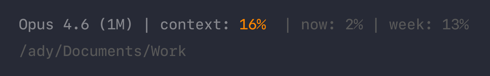

# claude-code-statusline

A custom status line for [Claude Code](https://claude.ai/claude-code) that shows the active model, context window usage with color-coded indicators, rate limits, and your current working directory. Works on macOS, Linux, and Windows.

## What it looks like



**Line 1:** Model name | context usage (color-coded) | rate limits (dim)
**Line 2:** Current working directory relative to home (dim)

### Color thresholds

The script uses **dynamic thresholds** based on context window size, because 1M-context models degrade earlier in absolute token terms:

| | Default | Orange | Red |
|---|---|---|---|
| **200K models** (Sonnet, Haiku) | 0--30% | 31--60% | 61%+ |
| **1M models** (Opus) | 0--15% | 16--35% | 36%+ |

The model name is shortened from `(1M context)` to `(1M)` to save space.

### Rate limits

When available, the status line shows two rate limit indicators in dim text:

- **now** -- your 5-hour rolling window usage
- **week** -- your 7-day rolling window usage

These fields appear after the first API response in a session.

## macOS / Linux

### Prerequisites

- [Claude Code](https://claude.ai/claude-code) CLI installed
- [`jq`](https://jqlang.github.io/jq/) -- a command-line JSON processor
  - macOS: `brew install jq`
  - Linux: `apt install jq` or `dnf install jq`

### Installation

1. Clone this repo:

   ```bash
   git clone https://github.com/adyrugina/claude-code-statusline.git
   ```

2. Copy the script to your Claude Code config directory:

   ```bash
   cp claude-code-statusline/statusline.sh ~/.claude/statusline.sh
   ```

3. Make it executable:

   ```bash
   chmod +x ~/.claude/statusline.sh
   ```

4. Add the status line configuration to `~/.claude/settings.json`:

   ```json
   {
     "statusLine": {
       "type": "command",
       "command": "sh ~/.claude/statusline.sh"
     }
   }
   ```

   If you already have a `settings.json`, just add the `"statusLine"` key to your existing object.

5. Restart Claude Code. The status line will appear at the bottom of the terminal.

## Windows

### Prerequisites

- [Claude Code](https://claude.ai/claude-code) CLI installed
- PowerShell (included with Windows)

### Installation

1. Clone this repo:

   ```powershell
   git clone https://github.com/adyrugina/claude-code-statusline.git
   ```

2. Copy the script to your Claude Code config directory:

   ```powershell
   Copy-Item claude-code-statusline\statusline.ps1 $env:USERPROFILE\.claude\statusline.ps1
   ```

3. Add the status line configuration to `~/.claude/settings.json`:

   ```json
   {
     "statusLine": {
       "type": "command",
       "command": "powershell -NoProfile -File C:/Users/YOUR-USERNAME/.claude/statusline.ps1"
     }
   }
   ```

   Replace `YOUR-USERNAME` with your Windows username. If you already have a `settings.json`, just add the `"statusLine"` key to your existing object.

4. Restart Claude Code. The status line will appear at the bottom of the terminal.

## How it works

Claude Code pipes a JSON object to the status line script via stdin on each update. The JSON contains:

- `model.display_name` -- the active model (e.g., "Opus 4.6 (1M context)")
- `context_window.used_percentage` -- what percentage of the context window is in use
- `context_window.context_window_size` -- the total context window size in tokens
- `rate_limits.five_hour.used_percentage` -- 5-hour rolling rate limit usage
- `rate_limits.seven_day.used_percentage` -- 7-day rolling rate limit usage

The script parses this JSON and outputs ANSI color-coded text across two lines.

For more details, see the [Claude Code statusLine documentation](https://docs.anthropic.com/en/docs/claude-code/settings#status-bar).

## Customization

- **Thresholds**: Change `warn` and `danger` values in the `if/elif/else` block for each window size
- **Colors**: Swap the ANSI color codes (orange = `38;5;208`, red = `31`, dim = `38;5;240`)
- **Rate limits**: Remove the rate limit section if you don't need it
- **Folder path**: Remove the folder path section or adjust the path logic for your setup

## License

[MIT](LICENSE)
